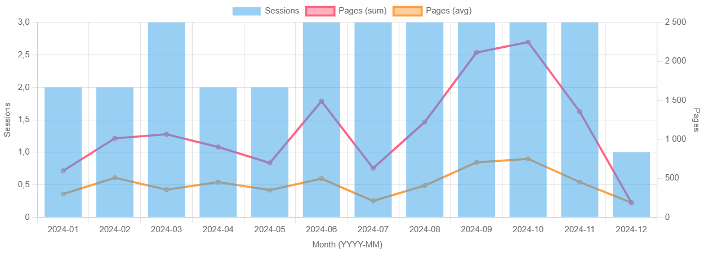
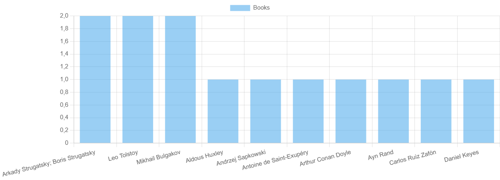
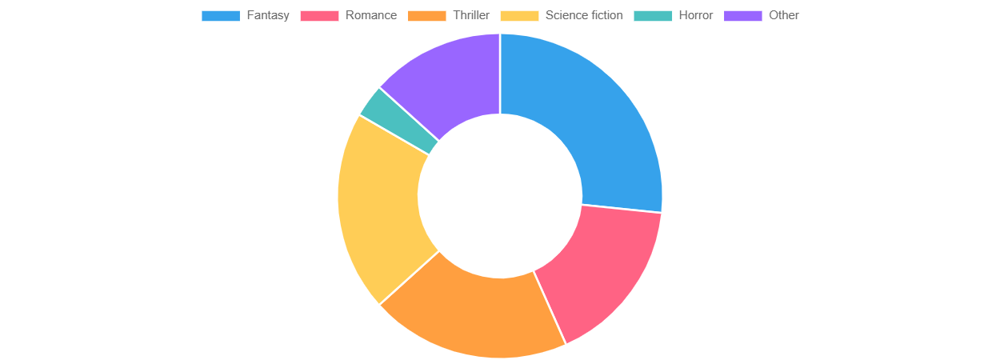

<p align="right">🌐 Languages: <b>English</b> · <a href="README_ko.md">한국어</a></p>

# Book Tracker — PHP/SQL Analytics

The project focuses on **queries and reports** for the `booktracker` database. PHP is used as a lightweight layer for input/output and Chart.js charts.

## Repository contents
- `index.php` — book submission form.
- `output_list.php` — book list (simple table).
- `stats.php` — charts page (Chart.js), builds reports directly from the DB.
- `check.js` — client-side input validation.
- `analytics.sql` — a set of basic analytical SQL queries (+ a couple of views).
- `README.md` — this file.
- `README_ko.md` — korean version of this file.
- `create_database.sql` — сreating the database and populating it

## Requirements
- XAMPP (PHP 8.x + MariaDB/MySQL), phpMyAdmin.

## Quick start
1. The scripts use a connection like:
   ```php
   new mysqli('localhost', 'root', '1234', 'booktracker');

2. Import the analytical queries.
Open phpMyAdmin → select your DB → Import → choose analytics.sql → Go.
Alternative (CLI):
"C:\xampp\mysql\bin\mysql.exe" -u root -p your_db < "C:\Path\analytics.sql"

3. Verify input/output.

http://localhost/index.php — add records

http://localhost/output_list.php — list

http://localhost/stats.php — charts

## What stats.php shows (In progress)
Monthly activity — books/pages/average per month.
Top authors — top authors by number of books.
Genre breakdown — distribution by genres (the genre field is stored as CSV).

## Data & assumptions

Genres are stored as a comma-separated string (e.g., Fantasy, Romance).
This is sufficient for simple reports.

## Features 

-- Adding books with details:
Reader name
Book title
Author
Genre
Page count
Finished date

## Tech stack
PHP 8.x
MySQL (via XAMPP)
phpMyAdmin

JavaScript / Chart.js

## Analytics





##  Structure of the database

```sql
CREATE DATABASE booktracker CHARACTER SET utf8mb4;
USE booktracker;

CREATE TABLE books (
  book_id INT AUTO_INCREMENT PRIMARY KEY,
  title VARCHAR(255) NOT NULL,
  author VARCHAR(255) NOT NULL,
  genre VARCHAR(100) NOT NULL,
  pages INT NOT NULL,
  UNIQUE KEY uk_books_title (title),
   KEY idx_books_genre (genre)
) ENGINE=InnoDB;


CREATE TABLE reading_log (
  log_id INT AUTO_INCREMENT PRIMARY KEY,
  reader_name VARCHAR(100) NOT NULL,
  book_id INT NOT NULL,
  pages_read INT NOT NULL,
  finished_date DATE NOT NULL,
  CONSTRAINT fk_log_book FOREIGN KEY (book_id) REFERENCES books(book_id)
    ON UPDATE CASCADE ON DELETE RESTRICT,
  UNIQUE KEY uq_reader_book_date (reader_name, book_id, finished_date), 
  KEY idx_log_reader (reader_name),
  KEY idx_log_date (finished_date)
) ENGINE=InnoDB;


# php-book-tracker
